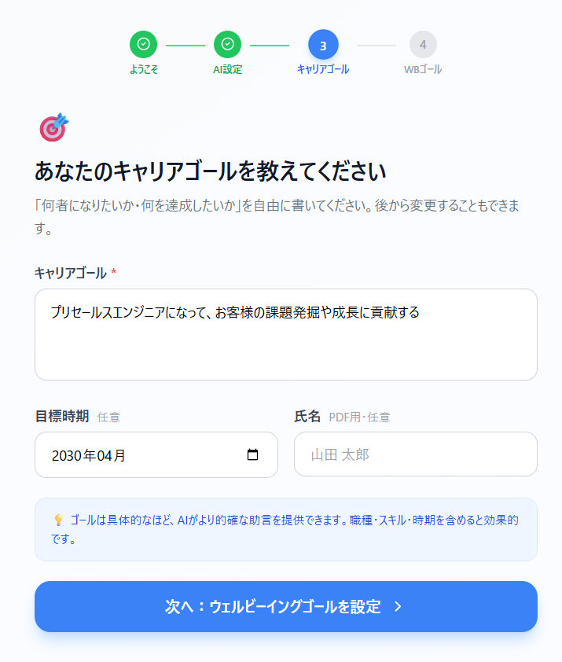
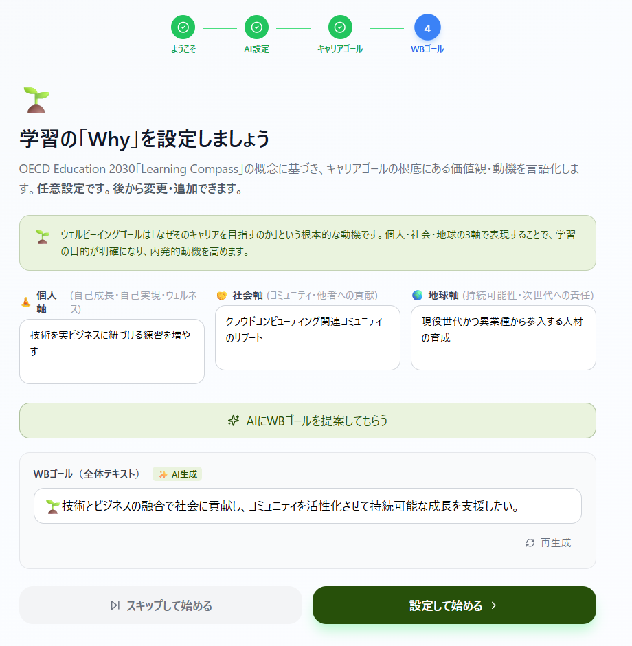
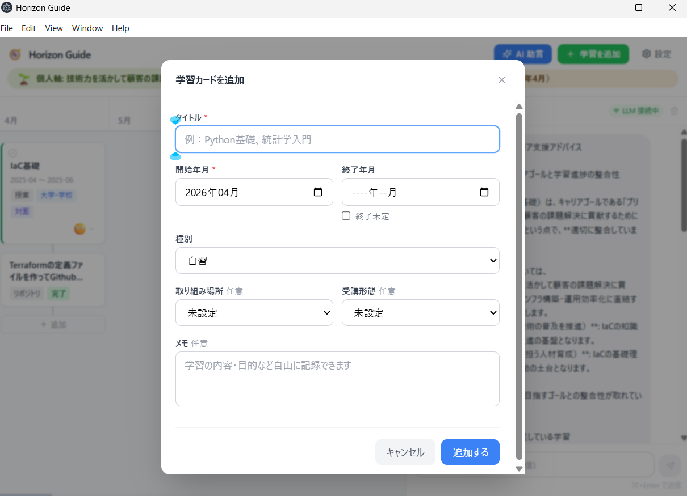
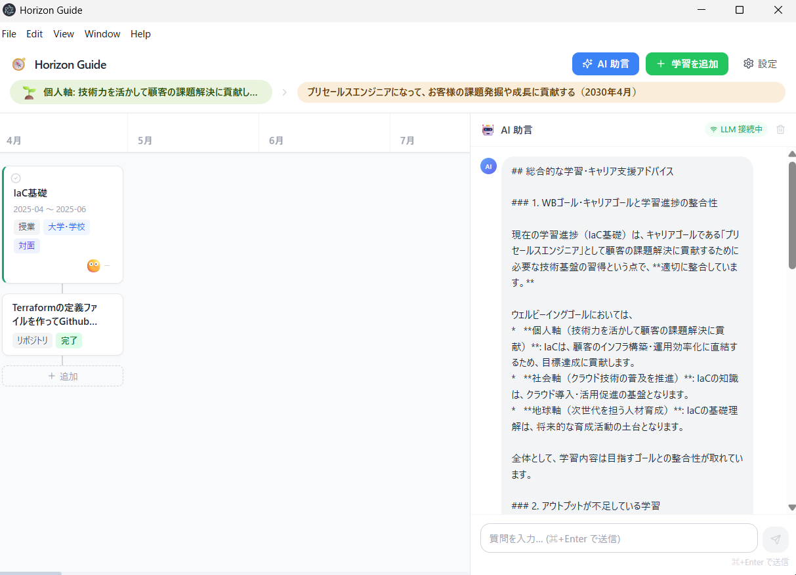

# 🧭 Horizon Guide

## 概要

Horizon Guide は、学習者がキャリアゴールとウェルビーイングゴールを起点に、過去・現在・未来の学習をタイムライン上で自ら設計・記録し、AIから助言を得ながら自らの学習とアウトプットを継続的に管理するデスクトップアプリケーションです。

```
ウェルビーイングゴール（Why）── OECD 2030：個人・社会・地球の3軸
      ↓
キャリアゴール（What）
      ↓
過去の学習 ── 進行中 ── 現在 ── 未来の学習
  └ アウトプット紐づけ       └ アウトプット紐づけ（予定）
      ↕
    AI助言（Chat mode / Analyze mode）
```
### 画面例
#### オンボーディング画面
初回起動時に、キャリアの目標（キャリアゴール）やなぜ学ぶのか「ウェルビーイングゴール」を定めます。
##### キャリアゴールの入力

##### ウェルビーイングゴールの入力


#### 学習登録画面
既に学んだ内容やこれから予定している学びの内容を登録する画面です。

#### 学習デザイン・AI助言（コーチング）画面
既に学んだ内容やこれから予定している学びの内容をもとに、AIが「ウェルビーイングゴール」と「キャリアゴール」をもとに、学びの助言を行います。



### 設計の特徴

- **学習の主体はユーザー** — AIが計画を自動生成せず、ユーザー自身がタイムラインを構築する
- **AIは助言役** — ゴール・タイムライン全体を参照して助言する（手動トリガー）
- **アウトプット駆動** — 各学習に成果物（記事・資格・リポジトリ等）を必ず紐づける
- **OECD Education 2030 対応** — Student Agency / AARサイクル / ウェルビーイングの思想を実装

---

## 主な機能

| 機能 | 説明 |
|------|------|
| 🎯 **キャリアゴール設定** | 目指す職種・状態を設定。タイムライン常時表示 |
| 🌱 **ウェルビーイングゴール** | 個人・社会・地球の3軸でキャリアの根底にある動機を言語化 |
| 📅 **横軸タイムライン** | 過去・現在・未来の学習を一覧で可視化。起動時に現在月を中央表示 |
| 📦 **アウトプット紐づけ** | 各学習カードに成果物（記事・資格・GitHub等）を必ず記録 |
| 😄 **モチベーション記録** | 5段階の顔アイコンで学習ごとのモチベーションを記録 |
| 🤖 **AI助言（Chat mode）** | サイドパネルでAIに相談。文脈を自動付加 |
| 🤖 **AI助言（Analyze mode）** | ボタン一押しでタイムライン全体をAIが総合分析 |
| 📊 **CSVエクスポート** | 学習・アウトプット・ゴール・AI履歴を5種のCSVでエクスポート |
| 🔬 **研究用行動ログ** | カード操作・モチベーション変化・ゴール設定を匿名化対応でエクスポート |
| 📄 **PDFポートフォリオ** | A4縦形式の学習ポートフォリオを生成 |

---

## AI接続

以下の接続方式に対応しています：

| 接続方式 | 説明 |
|---------|------|
| ☁️ **Gemini（クラウド）** | Google Gemini API（無料枠あり）。デフォルト：`gemini-2.5-flash-lite` |
| 💻 **ローカルLLM** | Ollama / LM Studio 等。APIキー不要・データが外部に出ない |
| 🔧 **Dify** | Dify Chat API（エンドポイント＋APIキー） |
| 🤖 **Claude / ChatGPT** | Anthropic / OpenAI API |

---

## 動作環境

| 項目 | 要件 |
|------|------|
| OS | Windows 10/11（64bit）または macOS 12 Monterey 以降 |
| Node.js | v24（LTS） |
| npm | v10以上 |

---

## セットアップ

```bash
# 1. リポジトリをクローン
git clone https://github.com/<your-username>/horizon-guide.git
cd horizon-guide

# 2. 依存パッケージをインストール（--ignore-scripts 必須）
npm install --ignore-scripts

# 3. Electronバイナリ取得 + ネイティブモジュールリビルド
npm run setup

# 4. 開発モードで起動
npm run dev
```

> ⚠️ `npm install`（引数なし）は使用しないでください。`better-sqlite3` のビルドスクリプトが自動実行されエラーになります。

### Windows の追加要件

`better-sqlite3` のビルドに **Visual Studio Build Tools 2022** が必要です。
インストール時に「C++ によるデスクトップ開発」ワークロードを選択してください。

---

## ビルド（配布用）

```bash
# Windows インストーラー（.exe）
npm run build:win

# Mac ディスクイメージ（.dmg）
npm run build:mac

# 両方同時
npm run build:all
```

---

## 技術スタック

| レイヤー | 技術 |
|---------|------|
| デスクトップ | Electron 41+ |
| フロントエンド | React 19 + TypeScript |
| ビルドツール | Vite v7 + electron-vite v5 |
| スタイリング | Tailwind CSS v3 |
| 状態管理 | Zustand |
| データ永続化 | SQLite（better-sqlite3 v12.8+） |
| APIキー保存 | keytar（OSキーチェーン） |
| PDF生成 | puppeteer |
| CSVエクスポート | papaparse + jszip |

---

## 研究的背景

OECD Education 2030「Learning Compass」の概念（Student Agency・AARサイクル・ウェルビーイング）をUIで実装し、学習意欲に関するデータを収集・分析することを目的としています。

研究用のデータ（行動ログ・モチベーション変化・ゴール設定）は、設定画面から匿名化してエクスポートできます。

---

## ライセンス

[MIT License](./LICENSE)

---

## 貢献

Issues・Pull Requests を歓迎します。
大きな変更を加える場合は、まず Issue でご相談ください。
